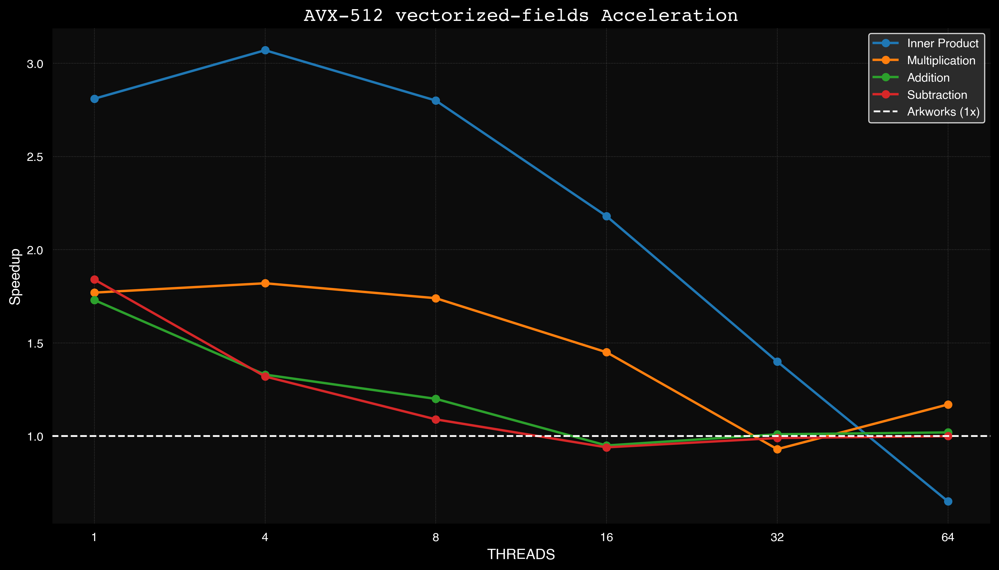
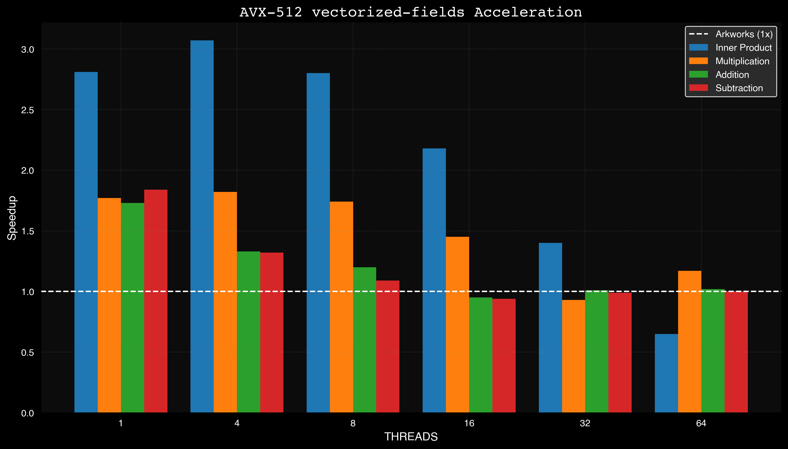

# vectorized-fields

A vector 256-bit arithmetic library focused on BN254 field operations.

## Features

This library provides optimized vector operations for BN254 field arithmetic, leveraging AVX-512 instructions. The following operations are supported:

- Vector operations: `add`, `sub`, `mul`, `sum`, `inner_product`
- Parallel versions: `add_par`, `sub_par`, `mul_par`, `sum_par`, `inner_product_par`
- In-place operations: `add_inplace`, `sub_inplace`, `mul_inplace`

All operations are suffixed with `_bn254`.

## Benchmarks

### Line Graph

### Bar Graph

## License

[MIT License](LICENSE)
