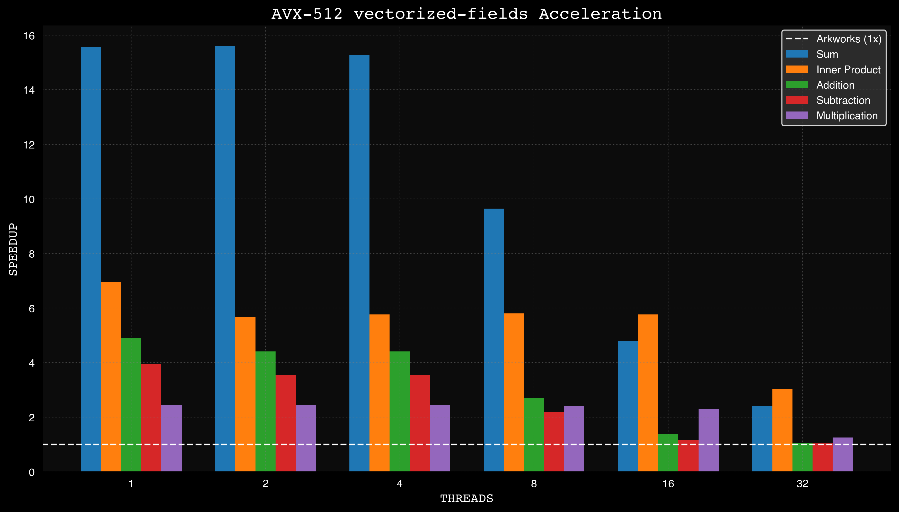
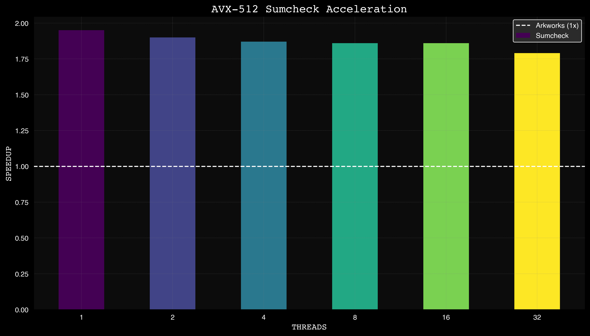

# vectorized-fields

Vectorized AVX-512 256-bit arithmetic library focused on BN254 field vector operations with Rust bindings. Boasts 1-3x speedups over plain CPU arithmetic.

The library performs elementwise operations on vectors:

$$
\mathbf{z} = \mathbf{x} \odot \mathbf{y} = \begin{bmatrix} x_0 \cdot y_0 \\\ x_1 \cdot y_1 \\\ x_2 \cdot y_2 \\\ x_3 \cdot y_3 \end{bmatrix}
$$

$$
\mathbf{z} = \mathbf{x} + \mathbf{y} = \begin{bmatrix} x_0 + y_0 \\\ x_1 + y_1 \\\ x_2 + y_2 \\\ x_3 + y_3 \end{bmatrix}
$$

$$
\mathbf{z} = \mathbf{x} - \mathbf{y} = \begin{bmatrix} x_0 - y_0 \\\ x_1 - y_1 \\\ x_2 - y_2 \\\ x_3 - y_3 \end{bmatrix}
$$

$$
z = \mathbf{x} \cdot \mathbf{y} = \begin{bmatrix} x_0 \\\ x_1 \\\ x_2 \\\ x_3 \end{bmatrix} \cdot \begin{bmatrix} y_0 \\\ y_1 \\\ y_2 \\\ y_3 \end{bmatrix} = x_0 \cdot y_0 + x_1 \cdot y_1 + x_2 \cdot y_2 + x_3 \cdot y_3
$$

## Features

This library provides optimized vector operations for BN254 field arithmetic, leveraging AVX-512 instructions. The following operations are supported:

- Vector operations: `add`, `sub`, `mul`, `sum`, `inner_product`
- Parallel versions: `add_par`, `sub_par`, `mul_par`, `sum_par`, `inner_product_par`
- In-place operations: `add_inplace`, `sub_inplace`, `mul_inplace`

All operations are suffixed with `_bn254`.

These operations use AVX-512 instructions for efficiency.

## Benchmarks 
> [!NOTE]
> Benchmarks performed on an AWS c7a.8xlarge instance.

*[sragss/gpu-sumcheck](https://github.com/sragss/gpu-sumcheck) at 6971f52*

## Future
Please get in touch with [@samrags_](https://x.com/samrags_) if you'd like specific changes or are curious if this works with your workload.